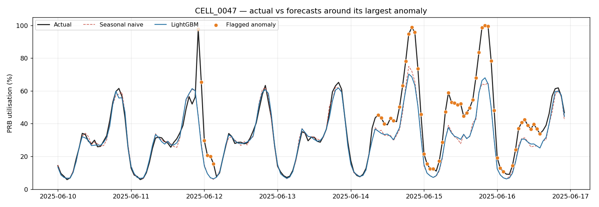

# ran-capacity-forecast

Day-ahead PRB utilisation forecasting, anomaly detection and capacity
recommendations for a cellular radio access network — packaged as a container,
deployed on Kubernetes, retrained nightly by a CronJob.

**The data is synthetic.** It is not operator data, and this README explains
exactly how it was modelled. See [Data and its limitations](#data-and-its-limitations).

```
 ingest/clean ──▶ seasonal-naive baseline ──▶ LightGBM ──▶ anomaly detection ──▶ FastAPI
   10-min KPI       same hour last week       lags ≥ 24h      MAD on residuals      /forecast
   → hourly/cell    (the thing to beat)       delta target    episode alerts        /anomalies
```

| | |
|---|---|
| **Headline** | LightGBM cuts MAE 23.2% vs the seasonal-naive baseline (MASE 0.837) |
| **Anomalies** | 96.7% of injected events detected (29/30), 1.83% of hours flagged |
| **Scale** | 60 cells × 120 days hourly; 30,217 cell-hours scored over 21 rolling origins |
| **Verify it** | `make install && make train && make verify` |

---

## Problem

A radio cell has a finite pool of Physical Resource Blocks. PRB utilisation is
the share of that pool in use, and it is the KPI that decides whether a cell
needs more capacity. When a cell sits at 100% during busy hour, users get
throughput collapse and latency spikes long before anything shows up as an
outage on a dashboard.

Two questions follow, and this project answers both:

1. **Which cells will run out of capacity, and when?** A 24-hour-ahead forecast
   per cell, with cells breaching a utilisation threshold surfaced as ranked
   recommendations.
2. **Which cells are behaving abnormally right now?** Deviation from that
   forecast, beyond a robust threshold on the residuals, raised as alert
   episodes rather than per-hour noise.

## Why this matters for a network in active rollout

A mature, static network can be planned from last quarter's peak. A network
being actively built out cannot, for three reasons this project takes seriously:

- **Traffic is growing, so the past understates the future.** Cells in the
  synthetic data grow 0.4–2.0% per month. Planning against a trailing average
  systematically under-provisions.
- **The busy hour moves.** A cell near new offices peaks 09:00–17:00; a
  residential cell peaks at 20:00; a transit cell peaks twice. Applying one
  network-wide busy-hour rule mis-sizes most of the estate. The model here is
  told which archetype each cell is and learns different shapes for each.
- **Manual review does not scale.** Sixty cells is a spreadsheet. Tens of
  thousands is not. The output is deliberately a *ranked, actionable list*
  (`/capacity-risk`), not a wall of charts.

Getting this wrong is expensive in both directions: under-provision and you
degrade service, over-provision and you spend capital on carriers nobody needed.

## Data and its limitations

**This is synthetic data. It is not from any operator, and no claim is made
that it reproduces real network statistics.** It was generated to have
realistic *structure* so that the pipeline can be built and, crucially, scored
against known ground truth.

### How the seasonality was modelled

Utilisation for cell `c` at time `t` is multiplicative:

```
prb(t) = base_c × daily_a(hour) × weekly_a(dow) × growth_c(t) × noise_c(t)
```

clipped to `[0, 100]`, since PRB utilisation is a bounded percentage.

| Component | How it is modelled |
|---|---|
| `base_c` | Mean load per cell, 22–52%. 15% of cells are deliberately "hot" at 58–74% so that busy-hour saturation actually occurs. |
| `daily_a` | 24 hand-drawn hourly knots per archetype, interpolated smoothly with wrap-around at midnight so there is no discontinuity at 00:00. |
| `weekly_a` | Seven day-of-week multipliers per archetype. Business cells drop to ~0.3 on Sunday; residential cells rise slightly at weekends. |
| `growth_c` | Linear trend, 0.4–2.0% per month, per cell. This is the "active rollout" term. |
| `noise_c` | AR(1) in log space (φ=0.65, σ=0.055) — **autocorrelated, not white**. This matters: white noise would make the "two consecutive breaches" confirmation rule trivially effective and overstate the detector. |

Four archetypes — `residential`, `business`, `transit`, `mixed` — with distinct
daily and weekly shapes.

**Anomalies are injected on purpose** and written to
`artifacts/injected_anomalies.csv`: outages (drop to near zero, 2–9h), spikes
(1.6–2.6×, 3–8h), and slow drifts (congestion building over 2–5 days). This is
what makes precision and recall measurable rather than a matter of eyeballing a
chart.

**Collection faults are injected separately** — missing row blocks and
out-of-range readings (`-1`, `999`). These are *not* labelled as anomalies,
because a missing counter is a data-collection problem, not a network event.
Conflating the two is a mistake that would make the detector look good while
being operationally useless.

### What this data does not have

Being explicit about this matters more than the results table:

- **No spatial structure.** Real cells hand traffic to neighbours; when one
  sector saturates, load spills next door. Here cells are independent. A model
  exploiting neighbour correlation would beat this one on real data.
- **No events.** No stadium concerts, no public holidays, no weather. Real
  traffic has irregular external drivers that no amount of seasonality captures.
- **No topology changes.** No new cells, no re-homing, no antenna tilts. Every
  cell has full history, which conveniently sidesteps the cold-start problem
  that a real rollout hits constantly.
- **The seasonality is the one I put in.** The model is partly recovering a
  structure I designed. Strong results here are evidence the pipeline is
  *correct*, not evidence it would hit these numbers on live KPIs.
- **PRB utilisation only.** No throughput, no RRC connected users, no
  handover statistics — all of which a real capacity model would use.

Swapping in the Telecom Italia Milan dataset, or real PM counters, is a change
to `data/ingest.py` alone; nothing downstream assumes synthetic origins.

## Approach

### 1. Ingest and clean

10-minute readings → hourly means per cell. Three decisions worth defending:

- Out-of-range values are set to **NaN, never clipped** into the valid range.
  Clipping `999` to `100` silently invents a plausible-looking saturated hour.
- Short gaps (≤30 min) are interpolated; longer gaps stay missing and their
  hours are flagged `imputed` so they can be excluded from scoring.
- An hour is aggregated only if **at least half** its six sub-hourly samples
  survived. A "mean" over one sample out of six is not a mean.

### 2. Baseline first

`ŷ(t) = y(t − 168)` — same hour, one week ago. Twenty lines, and a genuinely
strong forecaster because the weekly cycle dominates cellular traffic. Every
subsequent model is measured against it, on identical rows. A model that cannot
beat this is not worth its operational cost.

### 3. LightGBM

- **Every lag is ≥ 24 hours.** Forecasting 24h ahead means `lag_1` is
  unavailable at forecast time: at 08:00 you do not have the 22:00 reading you
  would need for the 23:00 forecast. This is the single most common silent bug
  in forecasting projects, and there is a test for it (below).
- **No time-index feature.** Trees cannot extrapolate; `days_since_start` would
  fit the rollout trend in-sample and flatline out-of-sample. The trend is
  carried by the recent lags and the target definition instead.
- **The target is the delta from the baseline**: `y(t) − y(t−168)`. The model
  learns *what the baseline gets wrong*. Level and trend stay outside the tree
  ensemble where they belong, and a model that has learned nothing scores
  MASE ≈ 1.0 rather than something arbitrary.
- **L1 objective**, so training is robust to the anomalies present in the
  training window.

### 4. Rolling-origin backtest

Not a single split. The origin walks forward daily across the last 21 days;
train on everything up to the origin, forecast the next 24 hours, step, repeat.
The model refits weekly rather than at every origin — `make train-fast` refits
at every origin if you want the stricter version.

**On metrics: MAPE is reported but should not be the headline.** PRB
utilisation approaches zero overnight on business cells, so the denominator
collapses and MAPE explodes on precisely the hours nobody plans capacity for.
In this run, unfiltered MAPE is 8.67% while MAPE restricted to hours above 20%
utilisation is 4.85% — the same forecast, nearly a factor of two apart, decided
entirely by how you treat quiet hours. RMSE, MAE and **MASE** are the
headline numbers. MASE is scaled by the in-sample seasonal-naive MAE, so
`0.837` reads directly as "16% better than same-hour-last-week."

### 5. Anomaly detection

Residual-based, deliberately simple:

1. Residual scale estimated with **median absolute deviation, not standard
   deviation** — std is inflated by the very outliers being hunted, so a few
   large spikes raise the threshold and hide themselves. MAD has a 50% breakdown
   point; observed contamination is ~2%.
2. Scale estimated **per (cell, hour)** and shrunk toward the cell-level scale,
   because residual spread at busy hour is not residual spread at 04:00, and 21
   samples per hour-slot is too thin to trust alone.
3. Flag `|z| > k`, then require **two consecutive breaches**. Single-hour
   breaches are mostly noise; real events persist.
4. Consecutive flagged hours are collapsed into **alert episodes**, because that
   is the unit an operations team acts on.

No isolation forest, no autoencoder. On a residual series with a known scale, a
robust threshold is easier to tune, easier to explain at 3am, and easier to
defend. Complexity here would cost trust and buy very little.

---

## Results

Full generated tables and plots: **[docs/RESULTS.md](docs/RESULTS.md)**.
Regenerate with `make report` — the numbers are written from
`artifacts/metrics.json`, never retyped.

Evaluation: 21 daily origins, 24h horizon, **30,217 scored cell-hours**,
2025-06-10 → 2025-06-30.

| Model | RMSE | MAE | MASE | Bias | MAPE (util>20%) | MAE gain |
|---|---|---|---|---|---|---|
| Seasonal naive (same hour last week) | 5.122 | 2.540 | 1.089 | −0.119 | 6.39% | — |
| Seasonal naive + anomaly-cleaned history | 4.342 | 2.311 | 0.991 | −0.237 | 5.78% | 9.0% |
| **LightGBM (delta from cleaned baseline)** | **3.881** | **1.951** | **0.837** | −0.228 | 4.85% | **23.2%** |

Errors are in PRB percentage points. The three-row structure is the point: it
separates what came from **cleaning the data** (9.0%) from what came from **the
model** (a further 14.2%).

### Anomaly detection

| Metric | Value |
|---|---|
| Event-level recall | **0.967** (29/30 injected events) |
| — drift | 1.000 (11/11) |
| — outage | 1.000 (5/5) |
| — spike | 0.929 (13/14) |
| Hourly precision | 0.648 |
| Hourly recall | 0.375 |
| Hours flagged | 1.83% |
| Alert episodes raised | 146 |

**On the gap between event recall (0.967) and hourly recall (0.375):** this is
the intended behaviour, not a weakness. A sustained event gets absorbed by the
lag features after its onset, so the detector fires at the *start* and goes
quiet. An 8-hour outage produces one alert, not eight. For an operations team
that is correct; the alternative is alert fatigue.

The threshold sweep in [docs/RESULTS.md](docs/RESULTS.md) shows why `k = 3.5`
was chosen: moving from 2.5 to 3.5 cuts alert volume 41% (249 → 146 episodes)
while losing exactly one event out of thirty.



### Three things this project found

**1. The 168-hour echo.** An early run produced a confident false alarm on
`CELL_0056`: forecast 33%, actual 99.96%. It sat exactly one week after a real
outage on that cell — last week's outage had *become* this week's seasonal-naive
baseline. Every real event was generating a spurious one 168 hours later.
The fix (`anomaly.clean_history`) builds lag features from an anomaly-repaired
copy of the series while the target stays raw. It cut false positives 39% and
lifted precision from 0.48 to 0.65 with event recall unchanged. This is the
"cleaned history" row in the results table.

**2. The leakage test initially had no teeth.** The first version corrupted the
last 23 hours of data and checked that *earlier* feature rows were unchanged —
which no `shift()` operation could ever violate. Injecting a `lag_1` feature to
test the test, it passed. The real question is whether a row at time `t` depends
on anything after `t − 24`. The rewritten test corrupts the final 24-hour window
and asserts the feature rows *inside* that window are unchanged; with `lag_1`
re-injected it now fails correctly.

**3. Horizon and hour-of-day are confounded in the backtest.** Every origin is
23:00 UTC, so horizon 4 is always 03:00 and horizon 8 is always 07:00. The
spread across the by-horizon table is the daily load cycle, not error growth
with lead time. Measuring genuine lead-time decay needs staggered origins.
Flagged as a caveat in the results rather than presented as a finding.

---

## How to run locally

Requires Python 3.11+.

```bash
git clone <this repo> && cd ran-capacity-forecast
make install          # dependencies
make train            # generate → ingest → backtest → train → forecast  (~1 min)
make report           # regenerate docs/RESULTS.md and the plots
make verify           # tests + artifact consistency + API smoke test
make api              # serve on :8000
```

Then:

| URL | What it gives you |
|---|---|
| `http://localhost:8000/dashboard` | Small self-contained dashboard |
| `http://localhost:8000/docs` | Interactive OpenAPI docs |
| `/forecast/CELL_0007?horizon=24&include_history=168` | Forecast + baseline + actuals |
| `/anomalies?severity=high&limit=10` | Alert episodes, most severe first |
| `/capacity-risk` | Ranked capacity recommendations |
| `/metrics-summary` | The results table, served at runtime |

`make test` runs the suite on its own. `make help` lists every target.

The API serves **precomputed artifacts** loaded into memory at startup — it
never trains and never runs inference on the request path. Latency is a
dictionary lookup, pods scale horizontally with no shared state, and rolling
back a bad model is a file swap rather than a redeploy.

### Example

```bash
curl -s localhost:8000/capacity-risk | head -c 400
```

```json
[{"cell_id":"CELL_0002","site_id":"SITE_0000","archetype":"mixed",
  "peak_forecast":100.0,"hours_at_risk":14,"first_risk_hour":"2025-07-01T08:00:00Z",
  "recommendation":"Sustained congestion forecast: schedule carrier addition or cell split."}]
```

---

## How to deploy to Kubernetes

Tested on [kind](https://kind.sigs.k8s.io/); k3s works the same way.

```bash
make kind-up          # create the cluster
make k8s-deploy       # build image → load into kind → apply manifests → wait for ready
make k8s-status       # pods, deployment, service, cronjob, jobs, pvc
```

`make k8s-deploy` builds the image, loads it into kind, applies everything, waits
for the seed job to populate the volume, and blocks until the rollout is
complete. Then:

```bash
make k8s-port-forward          # API on http://localhost:8000/docs
make k8s-trigger-retrain       # fire the nightly CronJob immediately
make k8s-logs                  # tail API logs
make k8s-clean && make kind-down
```

### What is in `k8s/`

| File | Notes |
|---|---|
| `00-namespace.yaml` | `ran-forecast` namespace |
| `01-configmap.yaml` | Every tuning knob — horizon, anomaly `k`, log level. Changing the threshold is a ConfigMap edit plus a restart, not a rebuild. |
| `02-pvc.yaml` | Shared artifact volume between the CronJob (writer) and API pods (readers) |
| `03-deployment.yaml` | 2 replicas, liveness/readiness/startup probes, resource requests **and** limits, non-root, read-only root filesystem, all capabilities dropped |
| `04-service.yaml` | ClusterIP; reached via `port-forward` |
| `05-seed-job.yaml` | One-shot job to populate the volume on first deploy |
| `06-cronjob.yaml` | Nightly retrain at 02:00 UTC |

Choices worth explaining:

- **Multi-stage Dockerfile.** The builder stage compiles wheels with a full
  toolchain; the runtime stage copies only the wheels into `python:3.11-slim`.
  gcc never reaches the shipped image. `libgomp1` is installed explicitly —
  LightGBM links against OpenMP, and without it the image builds cleanly then
  dies at `import lightgbm`. That is the most common failure moving LightGBM
  onto a slim base.
- **`imagePullPolicy: IfNotPresent`.** With `Always` and no registry, kind
  parks the pod in `ErrImagePull` indefinitely.
- **Liveness ≠ readiness.** Liveness hits `/healthz` (is the process wedged);
  readiness hits `/readyz` (are artifacts loaded). Pointing liveness at
  `/readyz` means a slow volume mount restarts every pod in a loop instead of
  just holding traffic back.
- **CronJob `concurrencyPolicy: Forbid`.** Two retrains writing the same parquet
  files is a corrupted artifact and a torn read on the API side.
  `startingDeadlineSeconds: 3600` means a cluster that was down at 02:00 skips
  the run rather than retraining at 09:00 — the API keeps serving yesterday's
  artifacts either way, which is the safer failure.
- **Known limitation, stated rather than hidden:** the PVC is `ReadWriteOnce`,
  so all pods binding it must land on one node. Fine on single-node
  kind/k3s, not fine on a real multi-node cluster. The production answer is
  object storage with artifacts pulled at startup, or an RWX volume.

### `kubectl get pods`

> **TODO before publishing:** run `make k8s-deploy && make k8s-status` and paste
> the output or a screenshot here. Include the CronJob and a completed retrain
> job — a CronJob that has *run* is far more convincing than one that has merely
> been applied.

---

## Where this sits in an O-RAN architecture

Conceptually this is a **non-RT RIC rApp**. It consumes cell-level performance
counters — the kind exposed over the O1 interface to the SMO — aggregates them
to hourly per-cell series, and produces capacity guidance that a planning team
or a policy-driven optimisation function would act on. It operates on the
non-real-time control loop (seconds to days, here a nightly retrain and a
24-hour forecast), which is the timescale where trend, seasonality and
multi-week capacity decisions live. That is deliberately *not* where a near-RT
xApp operates: sub-second scheduling, beamforming and handover decisions sit on
the 10ms–1s loop inside the near-RT RIC, and nothing in this repo belongs there.
The distinction matters because it determines what the model is allowed to
assume — an rApp can afford a LightGBM refit over 150k rows and a 24-hour
lookahead; an xApp cannot. Output would reach the rest of the SMO through the
R1 interface rather than the REST endpoints used here for demonstration.

---

## What I would do next

Roughly in order of value:

1. **Prediction intervals, not point forecasts.** Capacity planning needs "95%
   chance of breaching 85%", not a single number. LightGBM quantile regression
   at τ ∈ {0.1, 0.5, 0.9} is a small change and a much more useful output.
2. **Staggered backtest origins**, to decouple horizon from hour-of-day and
   measure true lead-time error growth (finding 3 above).
3. **Cold start for new cells.** A rollout adds cells constantly, and they have
   no 168-hour history. Archetype-level pooled models, or hierarchical
   forecasting that borrows strength from the site, would cover the first weeks.
4. **Spatial structure.** Neighbour-cell and site-level features; saturation
   spills to adjacent sectors and this model cannot see it.
5. **Object storage for artifacts**, replacing the RWO PVC, so the deployment
   survives more than one node.
6. **Drift monitoring in the CronJob.** Compare each night's backtest MASE
   against a rolling baseline and refuse to promote a model that has degraded —
   right now the CronJob would happily overwrite good artifacts with bad ones.
7. **Real data.** Telecom Italia Milan, or operator PM counters. Everything
   above `data/ingest.py` is agnostic to where the series came from.
8. **SARIMA / Prophet comparison** on a per-cell basis, to quantify what the
   global cross-cell model gains over per-cell univariate approaches.

---

## Repository layout

```
src/ran_forecast/
  config.py            all settings, every one env-overridable via the ConfigMap
  data/generate.py     synthetic KPI generator + injected ground-truth anomalies
  data/ingest.py       cleaning, gap handling, 10-min → hourly resampling
  models/features.py   lag/rolling/calendar features — the leakage constraints live here
  models/baseline.py   seasonal naive + RMSE/MAE/MASE/MAPE/bias
  models/lgbm.py       LightGBM wrapper, delta target, persistence
  models/evaluate.py   rolling-origin backtest, segment breakdowns
  anomaly.py           MAD detection, history cleaning, episode grouping, scoring
  pipeline.py          orchestration + serving artifact construction
  api/                 FastAPI app, schemas, dashboard
scripts/
  train.py             nightly retrain entrypoint (what the CronJob runs)
  report.py            regenerates docs/RESULTS.md and the plots
  verify.py            one-command end-to-end check
tests/test_pipeline.py 16 tests; the leakage guard is the one that matters
k8s/                   namespace, configmap, pvc, deployment, service, seed job, cronjob
Dockerfile             multi-stage, non-root, libgomp1
```

## Tests

```bash
make test
```

16 tests. The centrepiece is `test_no_leakage_from_recent_hours`, which corrupts
the final 24 hours of history and asserts that feature rows inside that window
are unchanged — because a row at time `t` must depend only on data at `t − 24h`
or earlier. It fails immediately if anyone adds a sub-24-hour lag. The rest
cover out-of-range handling, resampling shape, the 168-hour baseline offset,
MASE self-consistency, MAD robustness under contamination, the consecutive-breach
rule, episode grouping, and history repair.

## Licence

MIT.
